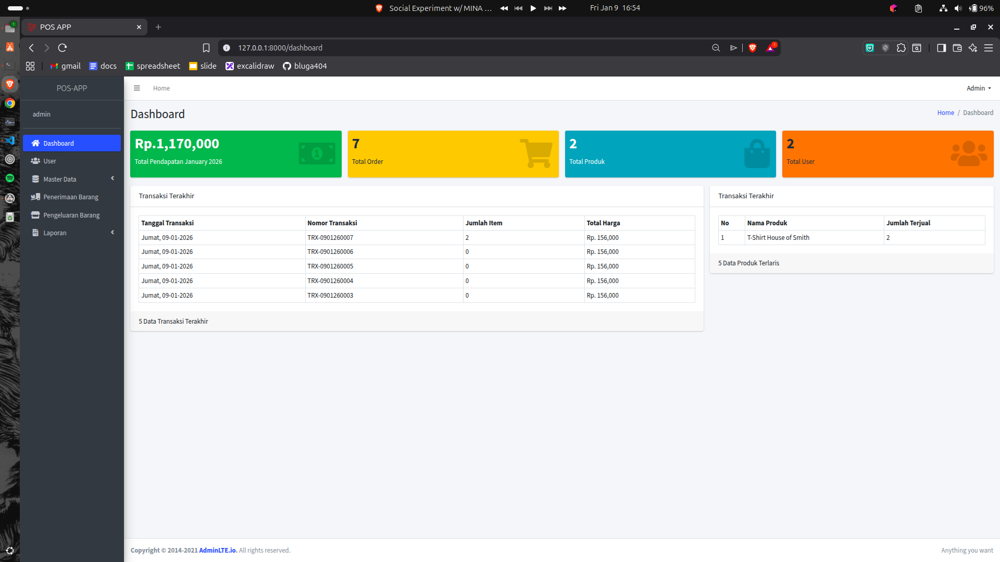

# POS APP (Point of Sale Application)

POS APP is a **web-based Point of Sale application** built with **Laravel**, designed to streamline sales management, inventory tracking, and transaction reporting in an integrated system.

This application is ideal for **small-to-medium retail stores**, outlets, or as a **Laravel learning project**.

---

## Key Features

### Dashboard
- Monthly revenue overview
- Total orders/transactions
- Total product count
- Total registered users
- Recent transactions list
- Top-selling products

### Product Management
- Add, edit, and delete products
- Real-time stock monitoring
- Product pricing management

### Stock In (Receiving)
- Input incoming goods/inventory
- Automatic stock increment
- Stock receiving history

### Sales Transaction (Stock Out)
- Product selection using **Select2 (AJAX)**
- Stock availability validation
- Automated calculations (Subtotal, Total, Payment, Change)
- Automatic stock deduction upon sale
- Unique transaction/invoice numbering

### User Management
- Multi-user support (Admin / Staff)
- Secure Laravel Authentication

### Reports
- Transaction history
- Total sales summary
- Best-selling product data

---

## Tech Stack

- **Framework:** Laravel 12
- **Language:** PHP 8
- **Database:** MySQL
- **Templating:** Blade Template
- **Frontend/UI:** Bootstrap / AdminLTE
- **Scripting:** jQuery, AJAX
- **Libraries:** Select2, DataTables, Carbon

---

## License

Open-source. Free to use for educational and learning purposes.

